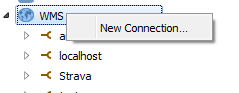
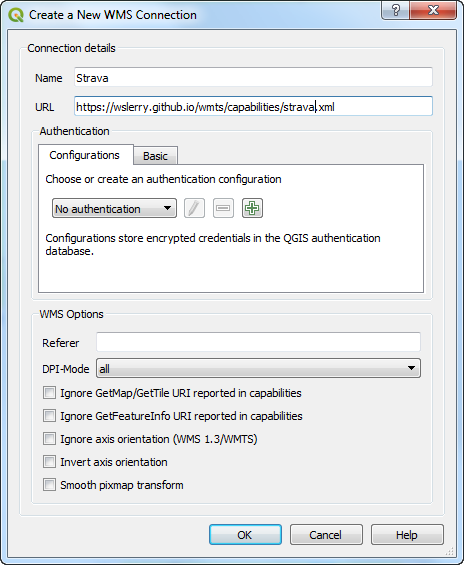
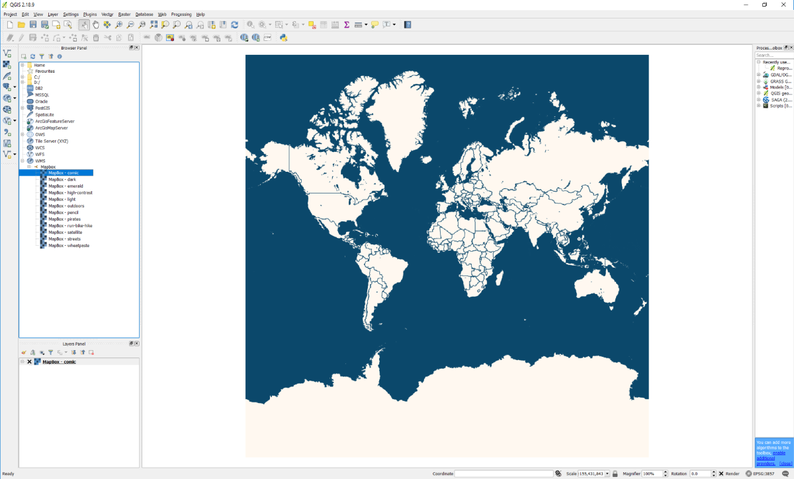

# wslerry/wmts

Collection of WMTS services.

Credit to <a href="https://github.com/bertt">https://github.com/bertt</a>

# How to add WMTS in QGIS

Browser panel,right click WMS -> WMS -> New Connection

Copy link of xml file into URL address

Select layer

